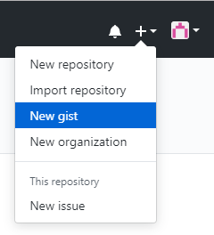

### Gitコマンド


2019/6/6 若手技術共有会
C1 山﨑瞬
---
まずは基本

```git
git init
git add .
git commit -m "Initial commit"
git commit -am "Modify README.md"
git push -u origin develop
git clone https://github.com/xxx/xxx.git
```
---
- こんなのはGUIツールで十分できる
- おすすめはVisual Studio 2019 (笑) |
---
ただ！今日ぜひ覚えてほしいGitコマンドがひとつだけあります！
---
```git
git commit --amend -m "コメント"
```
---
何ができるか
---
コミットの上書き

- コミットコメントを変えたい・・・|
- １ファイルだけ修正し忘れた・・・|
- 変数のつづりを間違えた・・・|
---
新しいコミットでもいいですが
---
差分を見るために1つのコミットにまとめたいことありますよね
---
そんなときは、再度修正してからこのコマンド

```git
git commit --amend -m "コメント"
```
---
ただし、乱用はしないように（歴史の改変はタイムパラドクスを発生させる可能性があります）
---
おまけ１
--- 
- リモートブランチ作成して管理するほどじゃない（個人的なコードとか）
- けどGit管理したい
---
```git
git init
```
---
ローカル環境だけでも当然Git管理できます
---
おまけ２
---
ディレクトリ管理するほどでもない簡単なファイルのバージョン管理
---
Gist
---

---
おまけ３
---
Gitでスライド作成
---
[GitPitch](https://github.com/kakisoft/HowToUseGitPitch)
---
実はこのスライドもGitPitchで作成しています
[https://github.com/shn-yamazaki/MyGitPitch/edit/git-command/PITCHME.md](https://github.com/shn-yamazaki/MyGitPitch/edit/git-command/PITCHME.md)
---
EOF
