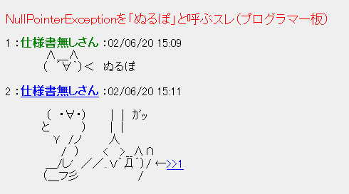

### null安全


2019/6/13 若手技術共有会
C1 山﨑瞬
---
ぬるぽ
---
ガッ
---

---
null安全とは
---
安全にnullが使えるということ
---
もう少しわかりやすく
---
```cs
class Person
{
  public string Name { get; set; }
  public int Age { get; set; }
}

class NullPoTest
{
  public static void Main()
  {
    Person someone = null;
    Console.WriteLine(someone.Name);
  }
}
```
---
実行すると
---
System.NullReferenceException
---
実行時エラーが起きる
---
もしC#がnull安全だったら
---
```cs
class Person
{
  public string Name { get; set; }
  public int Age { get; set; }
}

class NullPoTest
{
  public static void Main()
  {
    Person someone = null;
    Console.WriteLine(someone.Name);
  }
}
```
コンパイルエラー
---
null安全とは、nullが原因で実行時にエラーにならないこと
---
つまり、実行時にぬるぽになる可能性があるとコンパイルエラーとして報告してくれる
---
```cs
class NullPoTest
{
  public static void Main()
  {
    Person someone = null;
    
    if (someone != null)
    {
      Console.WriteLine(someone.Name);
    }
  }
}
```
これでコンパイルエラーじゃなくなる
---
再掲

---
殴られる危険性がない = 安全
---
---
---
---
---
EOF
